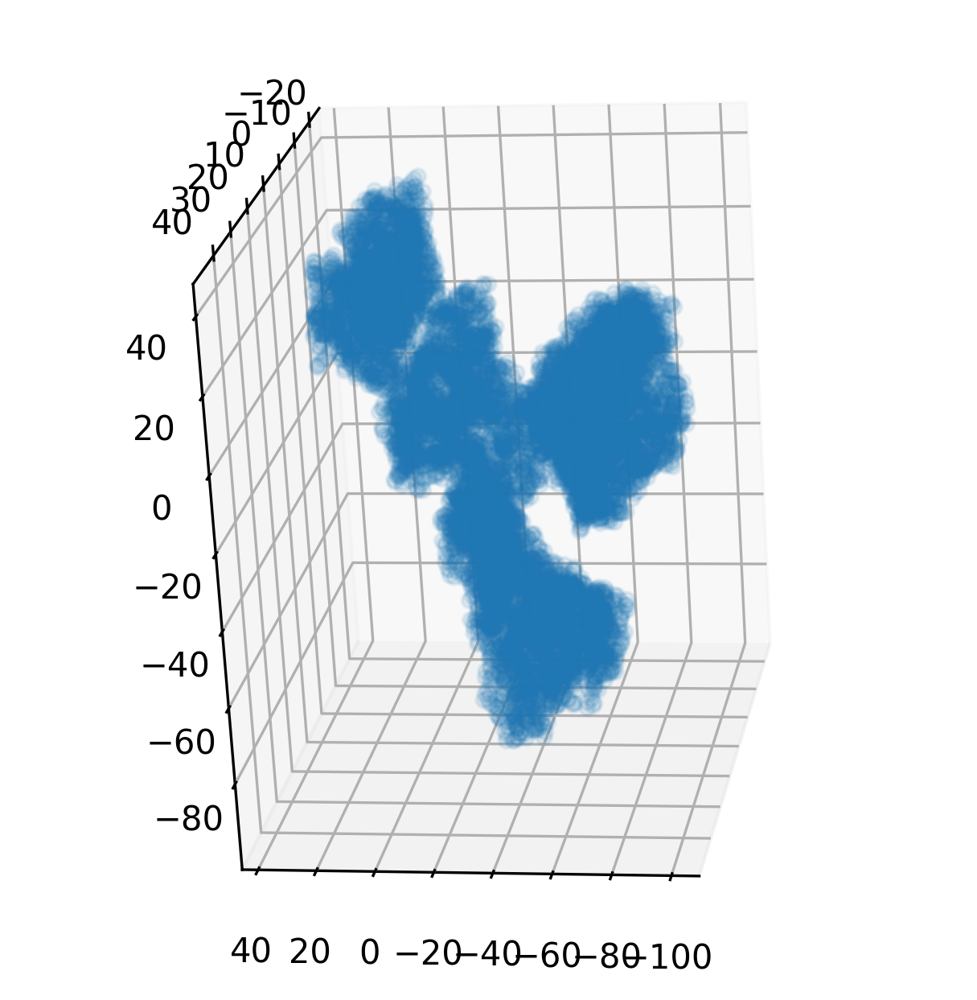
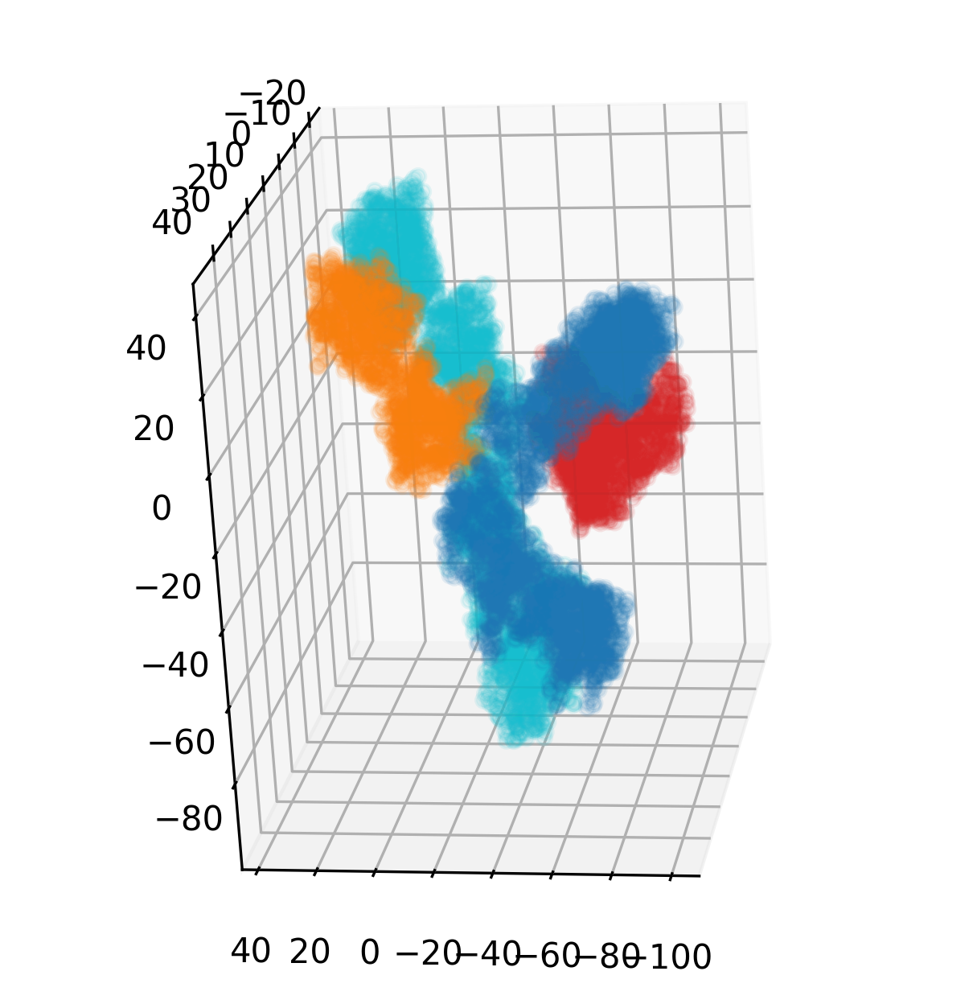
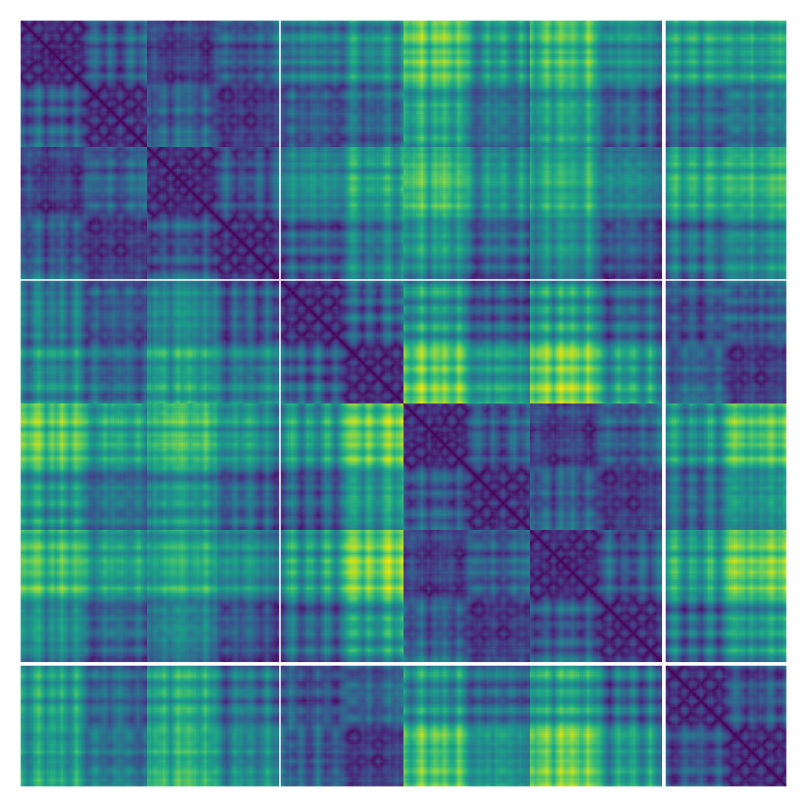

# protstruc

[](https://badge.fury.io/py/protstruc)
[](https://dohlee.github.io/protstruc)
[](https://github.com/psf/black)

Protein structure handling in Python made easy.

Dealing with a batch of protein structures is a common task in this new era of artificial intelligence-based protein structure prediction, optimization, and design.
This package, `protstruc`, provides an easy-to-use interface to handle a batch of protein structures, while specifically designed for deep learning applications based on PyTorch.
`protstruc` provides various features including:

- Computing geometric features of a protein structure (e.g., pairwise distance matrix, backbone dihedrals, backbone orientations, backbone translations, pairwise dihedrals and pairwise planar angles)
- Manipulation of protein structures (e.g., selecting specific chains, selecting specific residues, rotating the structure, translating the structure, zeroing the center-of-mass, etc.)

There are many options to initialize the core data structure for a batch of protein structures, `StructureBatch`:

- from local PDB files `StructureBatch.from_pdb`
- from PDB IDs `StructureBatch.from_pdb_id`
- Backbone (or even full-) atom 3D coordinates `StructureBatch.from_xyz`
- Backbone orientation and translations `StructureBatch.from_backbone_orientations_translations`
- Dihedral angles `StructureBatch.from_dihedrals` (WIP)

## Installation

Simple enough, just use `pip`:

```bash
pip install protstruc
```

## Examples

### Loading a structure from a PDB identifier, getting atom 3D coordinates and visualizing it

This code snippet loads a structure of a renowned monoclonal antibody targeting PD-1, named Pembrolizumab, from its PDB identifier 5DK3, and visualizes its structure.

```python
import matplotlib.pyplot as plt
from protstruc import StructureBatch

# Load a structure from a PDB identifier
struc = StructureBatch.from_pdb_id('5dk3')
# Full-atom 3D coordinates of shape (batch_size, num_residues, max_num_atoms_per_residue, 3)
# Note that max_num_atoms_per_residue is set to 15 by default.
# Also note that in this case, batch_size=1
xyz = struc.get_xyz()

# Visualize the structure
fig = plt.figure(figsize=(5, 5))
ax = fig.add_subplot(111, projection='3d')
ax.scatter(
    xyz[0, :, :, 0], xyz[0, :, :, 1], xyz[0, :, :, 2],
    alpha=0.1, c='C0'
)
ax.view_init(20, 20)
```



### Selecting specific chains

You may need a selector for specific peptide chains for some reason.
A `StructureBatch` object provides handy methods `get_chain_ids` and `get_chain_idx` to get chain IDs and the integer indices to represent the corresponding chains, respectively.
The following code snippet generates boolean masks for each chain, uses them to select specific chain and colors heavy chain with bluish colors and light chain with reddish colors.

```python
chain_idx = struc.get_chain_idx()[0]  # Note we only have one structure in the batch.
chain_ids = struc.get_chain_ids()[0]
# Let heavy chains colored in bluish colors,
# and light chains colored in reddish ones.
colors = ['C3', 'C0', 'C1', 'C9']

for idx, (chain_id, c) in enumerate(zip(chain_ids, colors)):
    mask = chain_idx == idx
    ax.scatter(
        xyz[0, mask, :, 0], xyz[0, mask, :, 1], xyz[0, mask, :, 2],
        alpha=0.1, c=c
    )
ax.view_init(-10, 20, 90)
```



### Computing geometric features of a protein structure

**Pairwise distance matrix**

```
from protstruc.general import ATOM
struc = StructureBatch.from_pdb_id('5dk3')

# Shape (batch_size, num_residue, num_residue, num_atom, num_atom)
distmat, distmat_mask = struc.pairwise_distance_matrix()
plt.matshow(distmat[0, :, :, ATOM.CA, ATOM.CA])  # Ca-Ca distance matrix
plt.axis('off')
```



## Testing

To test the integrity of the package, run the following command:

```bash
pytest
```
